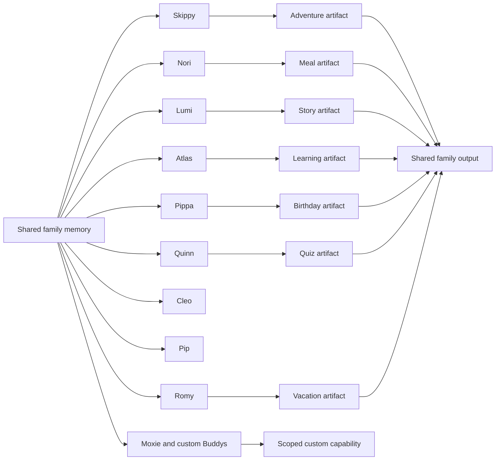

# Architecture and Product Boundaries

## Core Model

## A Sidekick Is a Capability Configuration

Each Sidekick contains:

- a focused identity and repeatable family job
- a dedicated system prompt and prompt version
- allowed context and safety boundaries
- a structured output schema
- one Corner with a purpose-built tool
- a separate conversation history
- one persistent Workbench Memory snapshot of its latest structured result
- access to the same read-only family profile
- a visible list of family facts used in each answer

This is not presented as autonomous multi-agent infrastructure.

## Active Routes

| Route | Model/tool | Output |
|---|---|---|
| `/api/buddies/chat` | GPT-5.6 Terra | conversational answer, memory used and follow-up prompts |
| `/api/events` | GPT-5.6 Terra and web search | sourced family event options |
| `/api/meals` | GPT-5.6 Terra | recipe, shopping gaps, adaptation and allergy check |
| `/api/stories` | GPT-5.6 Terra | complete age-appropriate personalized story |
| `/api/story-image` | GPT Image 2 | one on-demand story illustration |
| `/api/learning` | GPT-5.6 Terra with optional image input | task analysis, method and matched practice |
| `/api/birthday` | GPT-5.6 Terra | party concept, guests, schedule, invitation copy, budget and tasks |
| `/api/invitation` | GPT Image 2 | portrait invitation |
| `/api/quiz` | GPT-5.6 Terra | playable mixed-age quiz |
| `/api/buddy-builder` | GPT-5.6 Terra | installable custom Buddy blueprint |
| `/api/local-brief` | GPT-5.6 Terra and web search | sourced pharmacies or official family-service updates |
| `/api/destination-ideas` | GPT-5.6 Terra | three scope-aware destination directions with trade-offs |
| `/api/vacation` | GPT-5.6 Terra | family-paced itinerary, packing and budget guardrails |

All text responses are parsed against Zod schemas before display. The API key is read only in server route handlers.

## Browser State

`localStorage` keeps the editable family profile, parent contacts, doctors, appointments, institutions, document metadata, active parent, shared Home task completion, three personal Home Sidekick shortcuts per parent, messages per Sidekick, Workbench Memory per Sidekick, custom Buddy configurations and shared artifacts. The Family Memory UI validates the profile against the same Zod schema used by the APIs.

Crew Home is an aggregation surface over that state. Its forecast, school schedule, lunch plan, deadlines and unsaved local suggestion are explicitly labeled demo data. Saved meal and event artifacts replace the corresponding default Home summaries without pretending that background connectors are active.

Every structured Corner writes a bounded snapshot to its own Workbench Memory. `BuddyChat` sends that snapshot with the next message, the chat API labels it as the current object under discussion, and `Memory used` identifies it when the answer relies on it. Cleo and Pip derive their baseline context directly from the same live family directory; their optional sourced briefs replace that snapshot when searched.

JSON export and import are real browser actions. They make the storage boundary visible and portable without claiming an account, cloud database or cross-device sync. Editing or importing a family clears old generated results so one profile cannot inherit another family's conversation context.

## Safety Boundaries

- Skippy must not invent current events and relies on sourced search results.
- Nori treats allergies as hard constraints and avoids medical or nutrition claims.
- Lumi avoids copyrighted characters and frightening endings.
- Atlas sends a resized screenshot only for the active request; it is not added to Family Memory.
- Atlas prints generated practice locally; printing does not upload or persist a worksheet.
- Cleo never diagnoses or doses medication and exposes urgent escalation boundaries.
- Pip stores document metadata only in the POC and marks current administrative claims for official verification.
- Pippa keeps friend and parent contacts in the current browser, opens user-controlled drafts and calendar files, and never sends invitations automatically.
- Quinn rotates questions across a user-defined player list and scores players locally in the browser.
- Romy treats budgets as guardrails and never claims booking availability or live prices. CHECK24, Airbnb and hotel-search cards are explicitly simulated MCP handoff previews.
- Custom Buddys use an explicit memory allow-list generated in Moxie's workshop.
- Coordinates are optional and not persisted.
- Simulated commercial and connector actions cannot create external side effects.
- Traces show model, tools, duration and prompt version, never internal reasoning.

## Production Path

The browser store is a replaceable POC adapter, not the proposed production database. A production version requires authenticated encrypted profiles, household membership, per-field consent, private parent spaces, audited connector permissions, moderation, cost controls, observability, deletion workflows and domain-specific safety evaluation.
